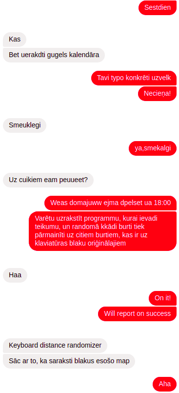

# Auto incorrect
It's like auto-correct, but it does the opposite - it introduces typos into your text

Available as a [demo Github Page](https://kshaa.github.io/keyboard-distance-randomizer/)

The inspiration for this great tool is the following conversation:  
